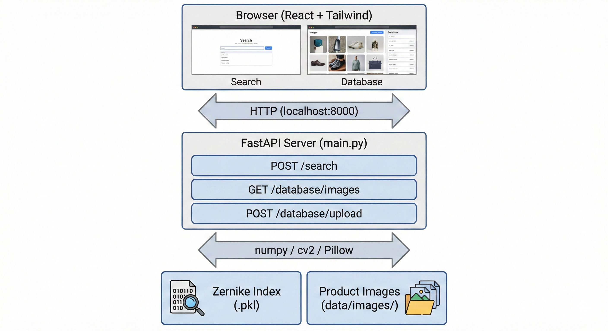
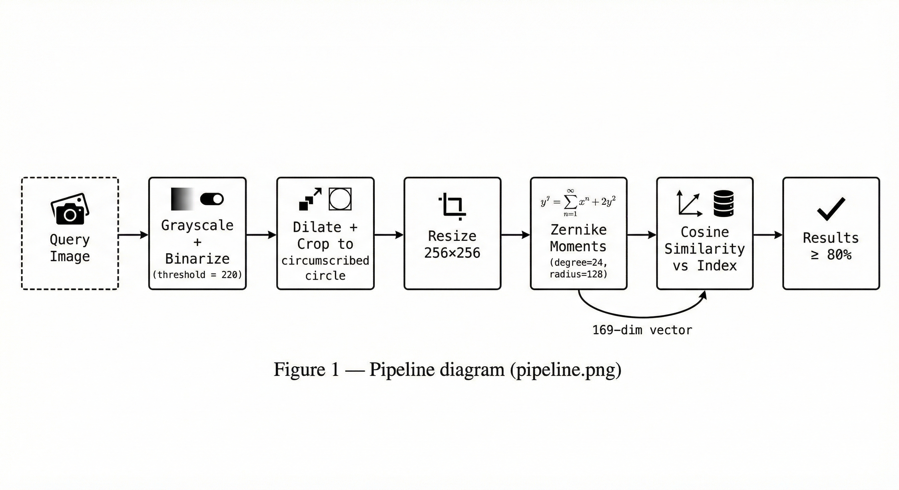
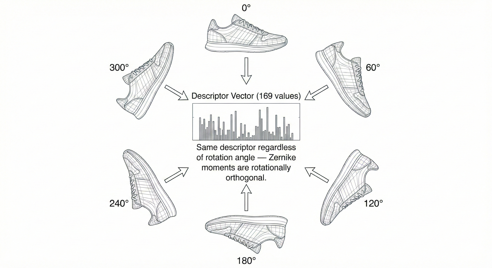
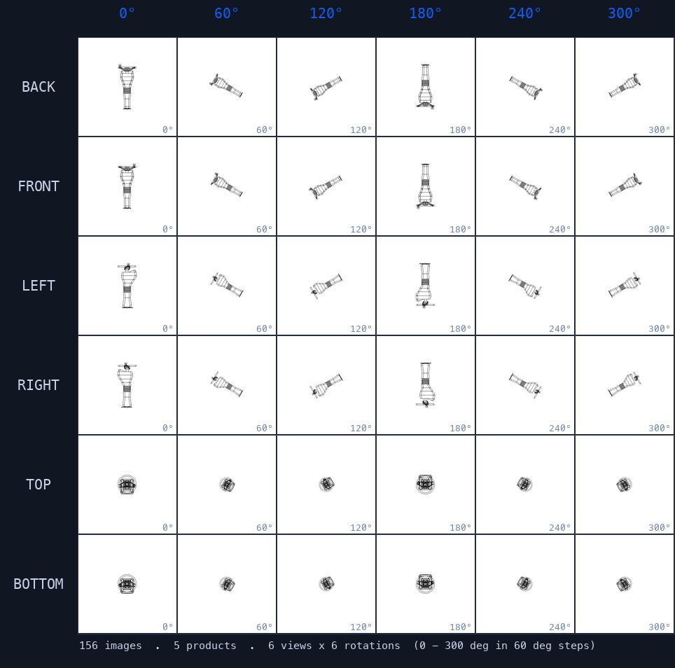

# Product Image Retrieval System — Zernike Moments CBIR

A **rotation-invariant** content-based image retrieval (CBIR) system for product images. Upload a photo of a product at any angle — the system finds all matching views in the database using Zernike moment descriptors. Ships as a fully offline Windows package requiring only Python.



## Key Features

- **True rotation invariance** via Zernike moments (degree=24, 169-dim descriptor)
- **No neural network** — pure math, runs on CPU, zero GPU required
- **Offline-first** — Windows zip with pre-built frontend, no internet needed at runtime
- **Web UI** — React + Tailwind dark-mode interface served by FastAPI
- **Database management** — upload, browse, and delete product images via browser

## How It Works

```
Query image
    │
    ▼
rembg background removal → alpha mask (foreground = alpha > 0)
    │
    ▼
Dilate (3×3 ellipse) → Bounding-box crop → Pad to square → Resize 256×256
    │
    ▼
Zernike moments (degree=24, radius=128) → 169-dim descriptor → L2 normalize
    │
    ▼
Cosine similarity against index → Return all matches ≥ 80%
```



Zernike polynomials are defined over the unit disk and are orthogonal under rotation, so a descriptor extracted from a 0° image is identical to one extracted from the same image at any rotation angle.

## Results

Tested against 260 images at random angles (13°, 53°, 58°, 72°, 115°, 126°, 141°, 280°, 328°, 347°…):

| Metric | Value |
|--------|-------|
| Descriptors | 169-dim (degree 24) |
| Index size | 156 product images × 6 views × 6 rotations |
| Similarity threshold | 80% cosine similarity |
| Correct product retrieved at rank 1 | ✅ across all test angles |



## Dataset Structure



Each product is captured from 6 views (BACK, FRONT, LEFT, RIGHT, TOP, BOTTOM) at 6 rotation angles (0°–300° in 60° steps), giving 36 images per product.

To regenerate this figure with your own product images:

```bash
python generate_grid_cells.py \
  --back BACK.png --front FRONT.png --left LEFT.png \
  --right RIGHT.png --top TOP.png --bottom BOTTOM.png
```

## Project Structure

```
图像检索系统/
├── main.py                  # FastAPI server — search, database, SPA serving
├── build_index.py           # Index builder — processes images → pickle
├── zernike.py               # Pure-numpy Zernike moments (no C deps)
├── generate_grid_cells.py   # Generates dataset grid figure from 6 view images
├── requirements.txt
├── install.bat              # Windows: one-click pip install from local wheels
├── start.bat                # Windows: start server + open browser
├── data/
│   └── images/products/     # 156 product images (6 views × 6 rotations each)
├── index/
│   └── zernike_index.pkl    # Pre-built index (paths + 169-dim descriptors)
├── test_random_rotations/   # 260 test images at random angles (13°–347°)
├── docs/                    # README figures
│   ├── Figure1.png          # Processing pipeline
│   ├── Figure2.png          # Rotation invariance illustration
│   ├── Figure3.png          # System architecture
│   └── Figure4_dataset.png  # Dataset grid (auto-generated)
└── frontend/                # React + Vite + Tailwind source
    ├── src/pages/
    │   ├── UploadPage.jsx       # Search interface
    │   ├── DatabasePage.jsx     # Database management
    │   └── ResultsPage.jsx      # Search results grid
    └── public/fonts/        # Offline fonts (Inter, Noto Sans SC, Material Symbols)
```

## Quickstart

### macOS / Linux

```bash
# 1. Create virtual environment and install dependencies
python3 -m venv .venv
source .venv/bin/activate
pip install -r requirements.txt
# Note: first run downloads U2Net model (~170MB) to ~/.u2net/

# 2. Build frontend (first time only)
cd frontend && npm install && npm run build && cd ..
cp -r frontend/dist frontend_dist

# 3. Rebuild index
python build_index.py

# 4. Start server
python -m uvicorn main:app --host 127.0.0.1 --port 8000
```

Open [http://127.0.0.1:8000](http://127.0.0.1:8000)

### Windows (offline)

Download the release zip → unzip → double-click `install.bat` → double-click `start.bat`.

Requires Python 3.8+ with "Add to PATH" checked. No internet needed after install.

## Rebuild the Index

If you add new images to `data/images/products/`:

```bash
python build_index.py
```

Naming convention: `{product_id}_{VIEW}_{rotation}.png`
Example: `0000_FRONT_90.png`, `ABC_BACK_0.png`

## API

| Method | Endpoint | Description |
|--------|----------|-------------|
| `POST` | `/search` | Upload image, returns all matches ≥ 80% similarity |
| `GET` | `/database/stats` | Total images and product count |
| `GET` | `/database/images` | Paginated image list |
| `POST` | `/database/upload` | Add images and update index |
| `DELETE` | `/database/images/{filename}` | Remove image and update index |
| `GET` | `/health` | Health check |

**Search response:**
```json
{
  "query_filename": "query.png",
  "results": [
    { "rank": 1, "filename": "0000_BACK_0.png", "label": "0000", "score": 0.9821, "image_url": "/images/products/0000_BACK_0.png" }
  ]
}
```

## Tech Stack

| Layer | Choice | Why |
|-------|--------|-----|
| Descriptor | Zernike moments (degree 24) | Mathematically rotation-invariant; scale & translation-normalized via bounding-box crop |
| Background removal | rembg + U2Net (ONNX Runtime) | CPU-only, handles any real-world background |
| Backend | FastAPI + uvicorn | Async, lightweight, auto-docs |
| Frontend | React + Vite + Tailwind | Fast build, dark mode, responsive |
| Similarity | Cosine (numpy matmul) | O(1) after L2 normalization |
| Storage | Pickle (numpy array) | Zero infra, fully portable |

## Dependencies

```
fastapi, uvicorn, python-multipart   # API server
numpy, opencv-python                 # Image processing
Pillow                               # Image I/O
rembg, onnxruntime                   # Background removal (U2Net, CPU-only)
colorama                             # Windows terminal colors
```

`rembg` downloads the U2Net model (~170MB) to `~/.u2net/` on first use. No internet access required after the initial download.

`zernike.py` is a pure-numpy implementation — no C compiler or platform-specific wheels required.
